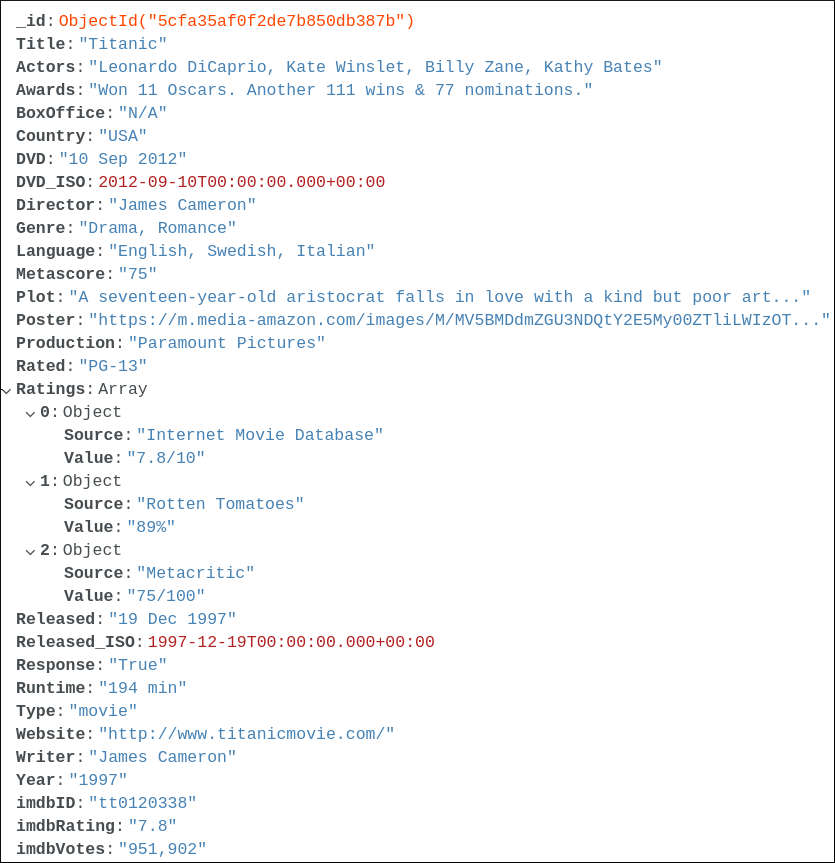

# MongoDB Stitch Data Enrichment

MongoDB Stitch is the serverless platform you can use to build backend services on top of MongoDB Atlas.

Let's build our first mini application with MongoDB Stitch. This workshop assumes you already have an Atlas cluster ready to use. If that's not the case, please go to the `atlas` branch first.

## What's the target?

In this workshop, we will write a movie title into our MongoDB Atlas cluster using a REST API POST webhook in MongoDB Stitch.

Then, using a trigger listening to new insertions in the movies collection, we will start a Stitch Function to enrich our document with data from the [OMDB API](http://www.omdbapi.com/).

A movie document at the end should look like this.



## Lab: Create a Stitch Application

- In MongoDB Atlas, click on Stitch on the left side and create a new Stitch application.
- You can use the deployment model *Local* and deploy in *Ireland* to keep it close to your Atlas cluster if you deployed your cluster in Ireland.

## Lab: Create a REST API

We want to create a simple REST API to read and write movie titles to MongoDB.

- Create a new HTTP Service.
- Create an incoming webhook for your POST route and secure your REST API with a *"secret as query param"*.
- Go to the webhook settings and try the provided CURL command. If you don't have CURL, use Postman.
- Verify in the *Logs* that you received something.
 

 
- Now let's replace the function and write the POST body to MongoDB. Replace the function code with this:
```js
exports = function(payload, response) {
  const mongodb = context.services.get("mongodb-atlas");
  const movies = mongodb.db("stitch").collection("movies");
  var body = EJSON.parse(payload.body.text());
  movies.insertOne(body)
  .then(result => {
    response.setStatusCode(201);
  });
};
```

- Now send your CURL command with the body : `'{"Title":"Titanic"}'`
- Verify in MongoDB Atlas that your new document has been written correctly.
 


- [optional] Repeat the same operations to implement a GET all titles route.
- Here is [some doc](https://docs.mongodb.com/stitch/mongodb/actions/collection.find/#finding-all-documents-in-a-collection) to help you.
- Don't forget that this time, you are returning results (check the webhook settings).

<details><summary>Click to see the answer</summary>
 
```js
exports = function() {
  const mongodb = context.services.get("mongodb-atlas");
  const movies = mongodb.db("stitch").collection("movies");
  return movies.find().toArray();
};
```
</details>

## Lab: Trigger

Now that we can write our awesome movie titles in MongoDB, we want to enrich our MongoDB document with some extra information about them.

- Let's create a free account on the [OMDB API](http://www.omdbapi.com/apikey.aspx). We will use them as a micro service.
- Once you have the API key, save it as a *Secret Value* in Stitch.


- Create a Trigger. It will listen to all the inserts and trigger a Stitch Function each time a document is inserted.
- You will need to create the Stitch Function. Take some time to read it and use the following code:

```js
exports = function(changeEvent) {
  const docId = changeEvent.documentKey._id;
  const title = encodeURIComponent(changeEvent.fullDocument.Title.trim());
  const movies = context.services.get("mongodb-atlas").db("stitch").collection("movies");
  const apikey = context.values.get("apikey");
  const omdb_url = "http://www.omdbapi.com/?apikey=" + apikey + "&t=" + title;
  
  return context.http
    .get({ url: omdb_url })
    .then(resp => {
    console.log(resp.body.text());
    var doc = EJSON.parse(resp.body.text());
    if (doc.Response == "False") {
      movies.deleteOne({"_id":docId});
    } else {
      movies.updateOne({"_id":docId}, {$set: doc});
    }
  });
};
```

- Insert a new movie in your collection using the POST route you created earlier.
- Check the result in your collection in MongoDB Atlas.
- If you have a problem, remember to check the logs.

# Conclusion

I hope you liked this workshop. If you want to see a more advanced "Mini Movie Collection" project, you can have a look on Github: https://github.com/MaBeuLux88/mongodb-stitch-movie-collection.

This solution contains a few extra features: 
- A website using the Hosting feature of MongoDB Stitch.
- Twilio integration so we can send a movie title by text message with our phone.
- Google OAuth for the authentication.
- Date parsing to ISO Date with a sub function.
- A second trigger is called on the update event (after the document is enriched) to calculate some stats.
- There are scripts leveraging the MongoDB Stitch CLI to help you import this project in your own Stitch Project.
